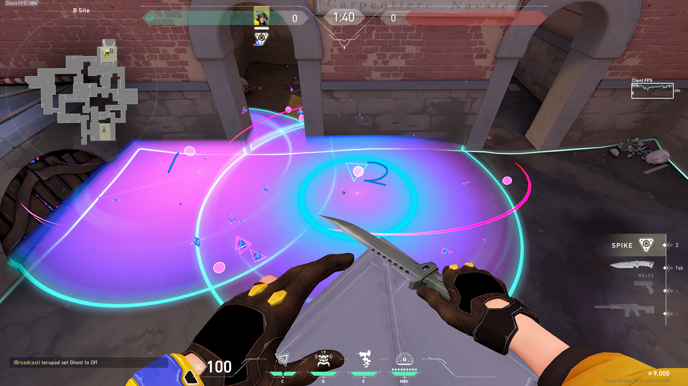

# アセント定点集
## 攻め
### Aエントリー ショート潰し
- 投げ方: そのまま投げ
- 概要 
ショートのモクからの飛び出しがウザい時など使う。

### Aエントリー ダブル裏潰し
- 投げ方: そのまま投げ
- 概要 
ダブル裏が完全に潰れる。

### Aエントリー 黒コン潰し
- 投げ方: そのまま投げ
- 概要 
黒コン裏と、こちらから見て黒コン裏右からのピークを抑えることが出来る。
黒コン左は潰せない。

### Bエントリー3箇所
- 投げ方: 全てジャンプ投げ
- 概要 
敵のよくいるポジションに応じて使い分ける。

### Aデフォ解除遅延 ワインから
- 投げ方: そのまま投げ
- 概要 
解除遅延。

### Aデフォ解除遅延 ドッグから
- 投げ方: そのまま投げ
- 概要 
解除遅延。ラークした時など。

### Bデフォ解除遅延 メインから

## 守り
### B設置止め
- 投げ方: そのまま投げ
- 概要 
エントリーされた時に、味方の寄り時間を稼ぐために使える。 
攻めであれば、解除遅延としても使える。ラークが遅れたがマケが取れている場合など有効。

### Aリテイク 箱裏潰し
- 投げ方: ジャンプ投げ
- 概要 
ダブルと、2番箱裏を潰せる。

### Aリテイク ワイン
- 投げ方: ジャンプ投げ
- 概要 
ロックダウンの逃げ先潰し。 
ロックダウンのカウントダウンが7~8秒になったくらいで投げて、着いた瞬間起爆すれば良い感じ。

