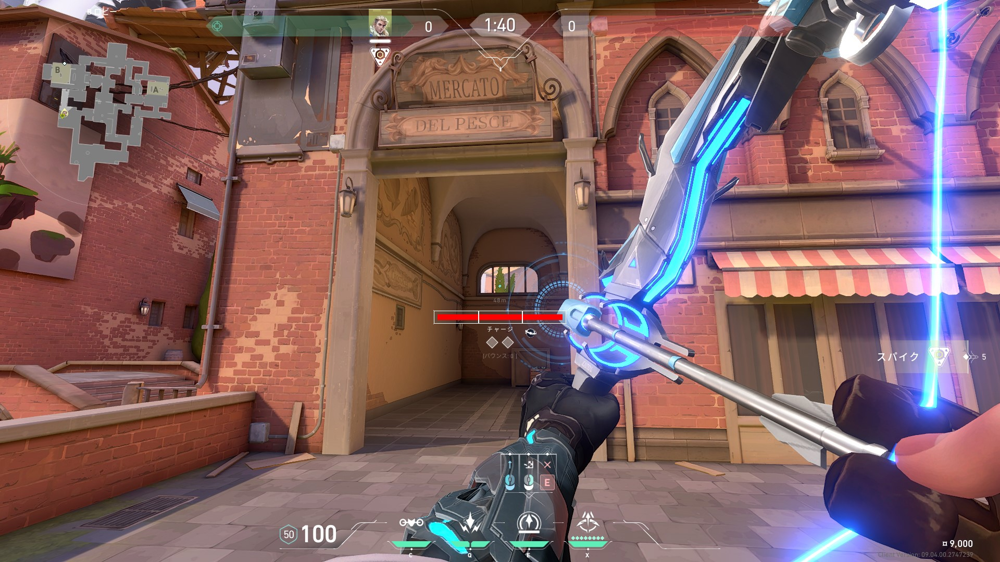
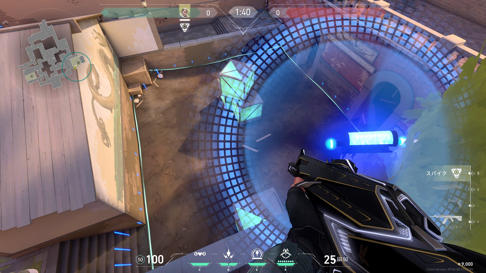
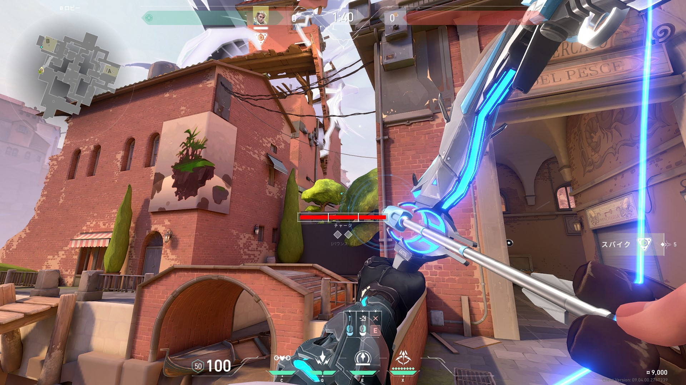
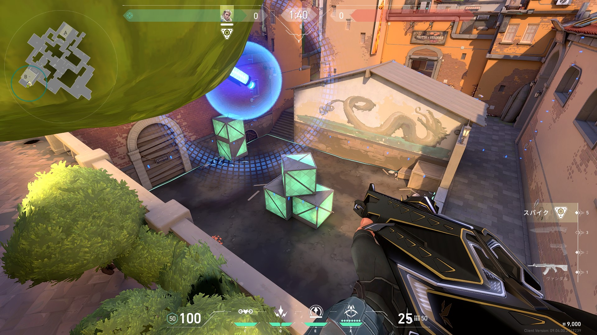
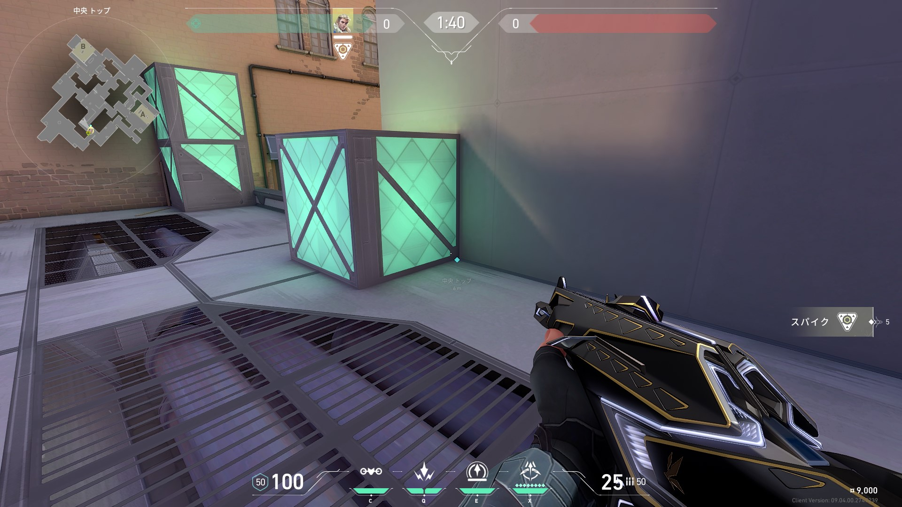
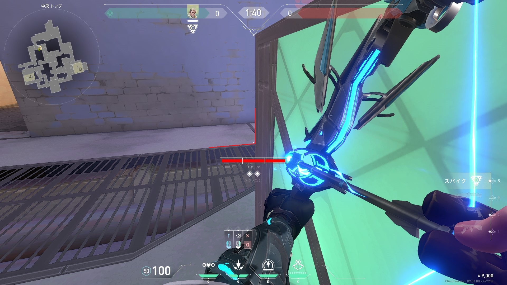
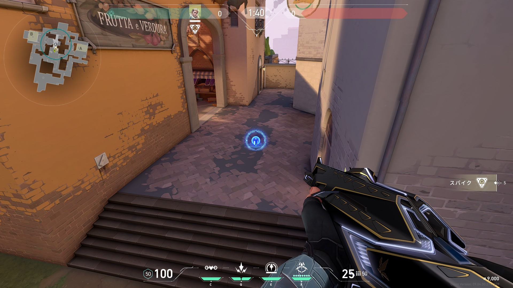
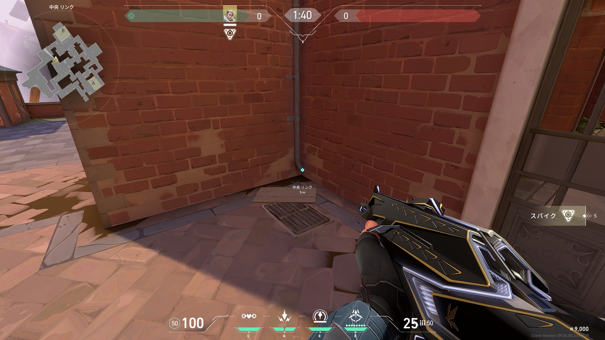
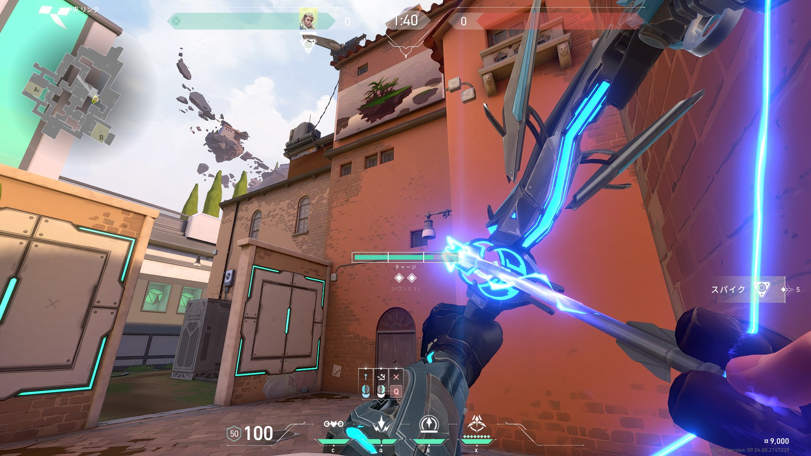
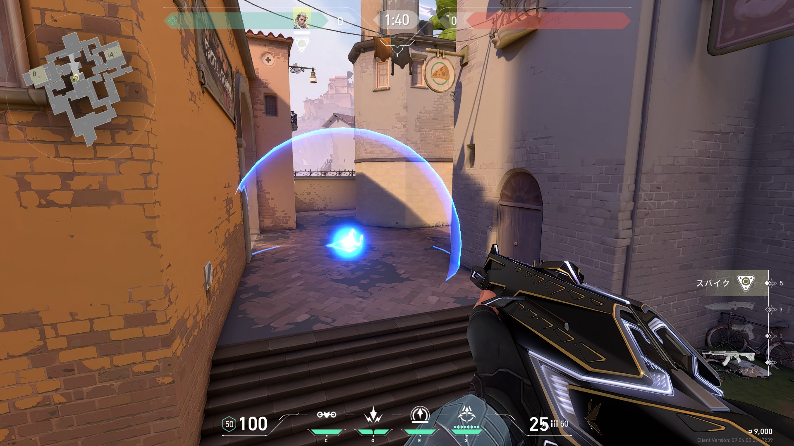

# アセント定点集
このページでは、ソーヴァのスキルのチャージ数について0/1/2/フルチャージと表記します。
## 攻め
### Bラッシュサイト中リコン（B）
- 2種類。フルチャージで当てるだけ。
- その1

- その2

### ミッドアラームボット破壊（A側）
- 角に立ち2バウンスフルチャージ
- 前目（階段）に置いてあるアラボは壊れない

### ミッドアラームボット破壊（B側）
- 角に立ち2バウンス2チャージ
- A側と同じ位置が壊れる

## 守り