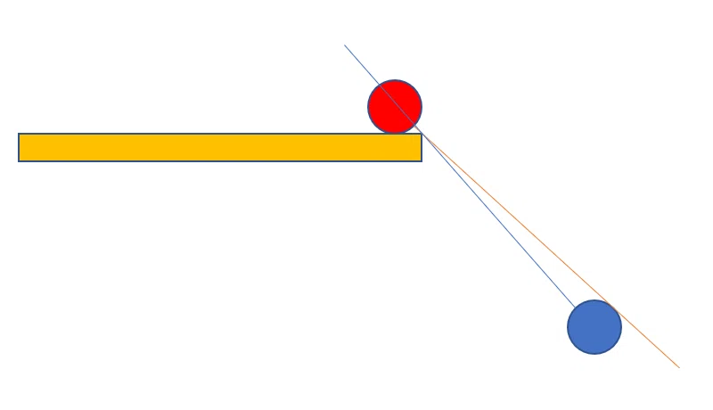

# プリエイムについて
## 概要
普段無意識にやっているプリエイムについて言語化して、その種類と使い所について考えてみる。

結論、プリエイムは大きく以下の2つに分けることが出来る。

- 追いプリエイム
- 事前プリエイム

それぞれのプリエイムの概要、強みと弱み、使い道について深堀ってみる。

## 追いプリエイム
壁から少し離した位置にクロスヘアを置いて、壁とクロスヘアの距離を保ち続けるようにエイムする。

クロスヘアの位置は、敵が見えた時に自分が反応できる位置にするとなおよい。

### 強み
事前プリエイムと比較して、速く進むことが出来る。 

アングルアドバンテージ(<a href='#angle_advantage'>※1</a>)がある状態で歩きながらこのプリエイムをしていると、敵の銃口が先に見えるので、敵の銃口が見えたら事前プリエイムに切り替えて飛び出すとよい。

補足として、アングルアドバンテージがある時は走っている時よりも歩いているときの方が先見え時間（こちらが敵を一方的に視認している時間）が長いので、歩くことで有利を生み出すことが出来る。
### 弱み
逆にアングルアドバンテージがない状態でこのプリエイムをすると、相手視点歩いてきた敵を先見して倒すだけになるので、たいてい撃ち負ける。かといって走ると、相手視点はただの音ゲーになるので、これもたいてい撃ち負ける。

また事前プリエイムと比較して、マウスを追いエイムに集中させる分、撃ち合いがやりづらい。
### 使い道
素早く進行したい場合。

こちらにアングルアドバンテージがあり、かつ敵の位置が未確定である（エイムしている位置にいるのか分からない）場合。

## 事前プリエイム
敵がいるところに壁越しにクロスヘアを置いて、走りを刻みながら進行する。

### 強み
走りながらかつ足音をたてないピークになるので、相手視点弾を当てづらい。

撃ち合いに集中できる。一度立ち止まってからピークするので、ワイドピークで倒しきるか、ショルダーピークにするか、引き撃ちにするか、など撃ち合いの選択肢を取りやすい。
### 弱み
進行が遅い。

クロスヘアを壁に合わせている瞬間は、飛び出してくる敵への対応がやりづらい。

<b>→プリエイムを適当にやっていると、前述の「先見え時間」の間にクロスヘアを壁に合わせているせいで、先見えの有利を捨てるケースがたまにある気がする。</b>

### 使い道
こちらにアングルアドバンテージが無いか、または敵の位置が確定している（エイムしている位置にいる）場合。 

## まとめ
以上を踏まえてアセントのBメインを進行すると、概ねこんな感じになる:

アングルアドバンテージがある状態で進行するときは追いプリエイム、アングルアドバンテージが無い状態での進行、または敵と撃ち合う時は事前プリエイム、と覚えておくとよい。

結局、撃ち合いの際は追いプリエイムよりも事前プリエイムを使うべき。

理由としては、こちらからピークする撃ち合いの動きは、「身体を出す→敵にエイムを合わせる→射撃する」ということなるので、この敵にエイムを合わせる作業を追いプリエイムの中でやろうとすると、壁にトラッキングし続けているマウスを敵にフリックすることになるが、事前プリエイムにおいてはこの敵へのフリックがマウスを止めた状態からの細かい修正のみで良くなるため。

## 補足
<h3 id="angle_advantage">※1 アングルアドバンテージについて</h3>
fpsでは、障害物に近い方のプレイヤーが、障害物から離れている方のプレイヤーに先見えされる。

画像参照: <a href="https://note.com/logic_/n/n46a9dd74a407">https://note.com/logic_/n/n46a9dd74a407</a>